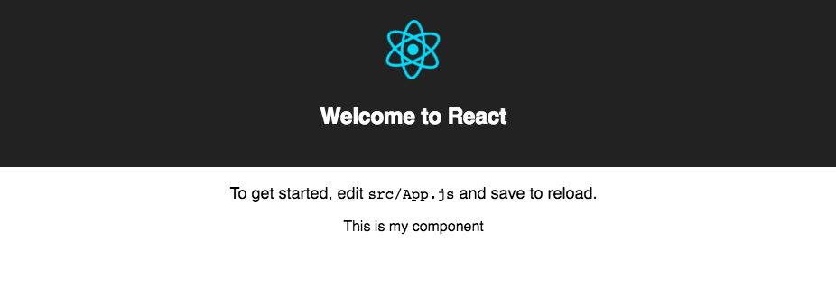

### Create React NPM Component

This tool is intended to make it simple to start writing a react component for publishing
to NPM. 

### Usage

Assuming you have a blank project made with create-reac

```
npm install -g create-react-npm-component

create-react-npm-component [project-name]
```

Go through the setup prompts and let it install needed dependencies, then if everything
finished correctly, you just have to link the project to your global `node_modules` in order
and then also link it to the project you wish to import it into...

```
cd [project-name]
npm link
npm start
```

In another terminal, fire up the project you want to import the compoent into for testing
and development.
```
cd /other/project-dir
npm link [project-name]
npm start

```
You can then import the component, and render it somewhere for development...

##### NOTE: this example is a stock `create-react-app` `App.js` file
```
import "./App.css";

import React, { Component } from "react";

import logo from "./logo.svg";
import MyComponent from "my-create-react-npm-component-project";

class App extends Component {
  render() {
    return (
      <div className="App">
        <header className="App-header">
          
          <h1 className="App-title">Welcome to React</h1>
        </header>
        <p className="App-intro">
          To get started, edit <code>src/App.js</code> and save to reload.
        </p>
        <MyComponent />
      </div>
    );
  }
}

export default App;
```

which should render the component in the stock `create-react-app` project



### Publishing

```
cd [project-name]
npm login
npm publish
```

### Contributing

1. Fork the repo
2. Clone your fork onto your local machine
3. make changes and install locally with `npm i -g` in the cloned directory
4. When you are happy with the changes, push it, and make a pull request.

